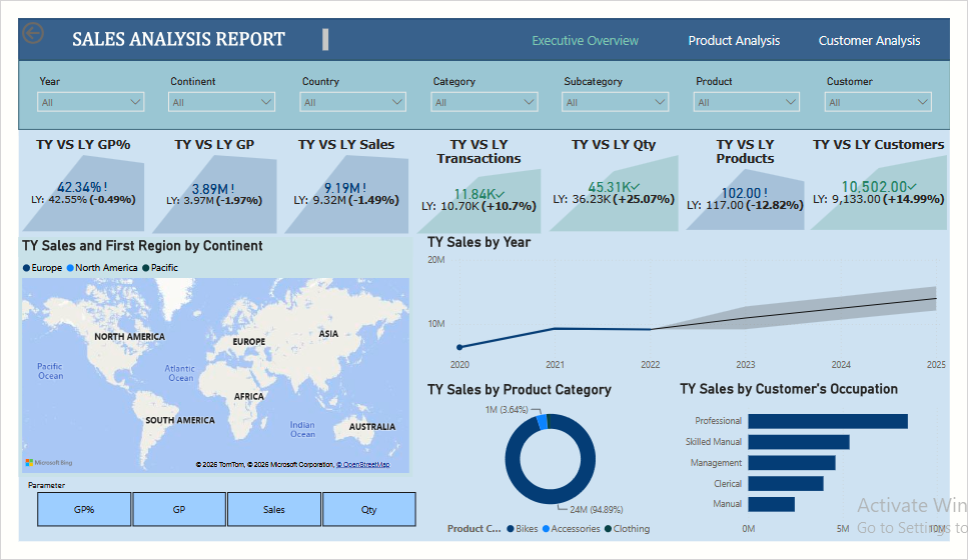
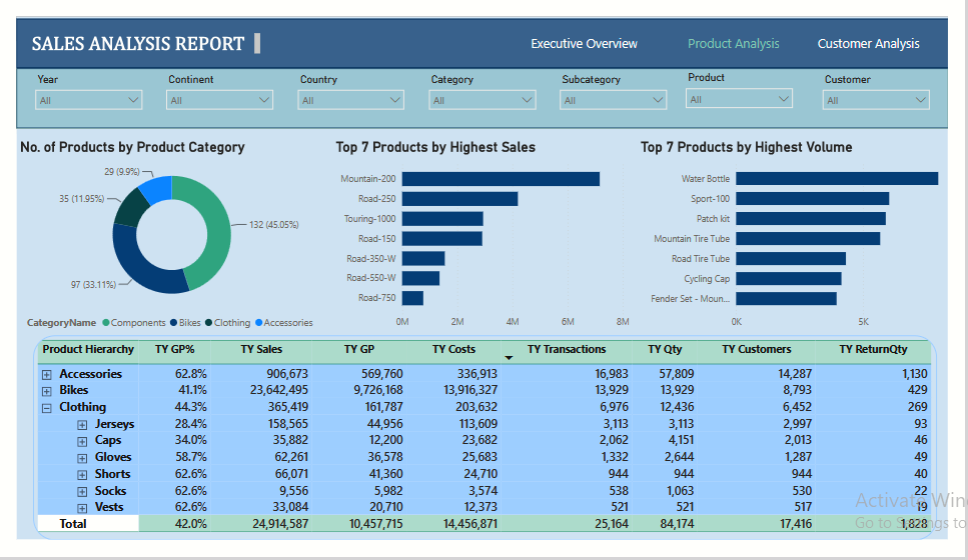

# Sales Analysis & Product Performance Dashboard

## 📌 Project Overview
A comprehensive analysis of sales transaction data (2020–2025) evaluating revenue trends, profit margins (GP%), order volumes, and customer demographic drivers across product categories.

## 🛠️ Tools Used
* **Data Visualization & Analytics:** Power BI, DAX
* **Data Processing:** SQL, Excel
* **Documentation:** Markdown

## 📊 Dashboard Preview
| Dashboard Overview | Product Analysis |
| :---: | :---: |
|  |  |

  
  

## ❓ Business Questions
1. Which product categories drive overall revenue vs. total volume?
2. How do profit margins (GP%) vary across regions and customer occupation types?
3. Are high-volume items producing optimal profit margins?

## 🔍 Key Findings
* **Revenue vs. Volume Disparity:** Bikes generate 94.89% ($23.64M) of total revenue but represent only 16.5% of total units sold. Accessories drive high transaction volume (57,809 units) but total under $1M in revenue.
* **Profit Margins:** Accessories yield higher GP% (62.8%) compared to Bikes (41.1%), while specific soft goods like Jerseys have lower profit margins (28.4%).
* **Key Demographics:** Professionals and Skilled Manual workers make up the largest purchasing segment.

## 💡 Business Recommendations
* **Product Bundling:** Combine high-volume Accessories with high-value Bike sales to maximize profit margins.
* **Margin Optimization:** Re-evaluate pricing strategies and vendor costs for low-margin apparel items like Jerseys.
